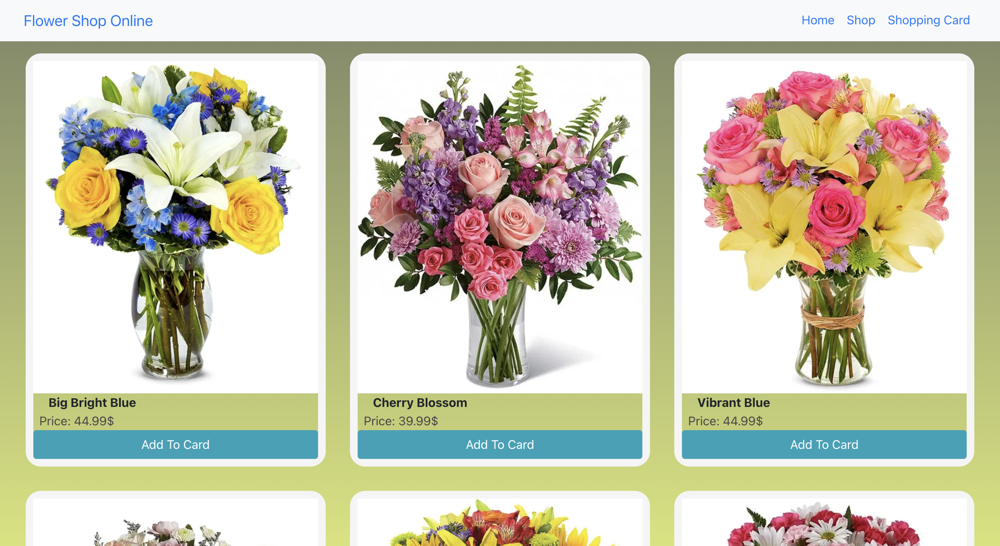

# Shopping list

## This is a shopping page website 

  

    
  

  

    
  

#
## Built With 

- JS
- HTML5
- CSS3
- Bootstrap
- React
#

## Live Demo

[Shopping List:]https://sandywezzy.github.io/shopping_list/

#

## Features
  - Webpage uses RouteSwitch from React
  - Several tests are included 
  - Responsive alignment of shopping list components

#
## Getting Started

In order to setup and work on this project on your own, you will need to:

1. Clone this project:  
`git@github.com:SandyWezzy/shopping_list.git`

2. Once you have cloned this project, you can install the required dependencies by using:  
`npm install`

3. A live demo of the project can be started by using:  
`npm start`

4. Distribution files can be produced using:  
`npm run build`

#
## 🤝 Contributing

Contributions, issues, and feature requests are welcome!
#
## Show your support

If you got until here, show your love hitting the ⭐️ button, I'd really appreciate it.
